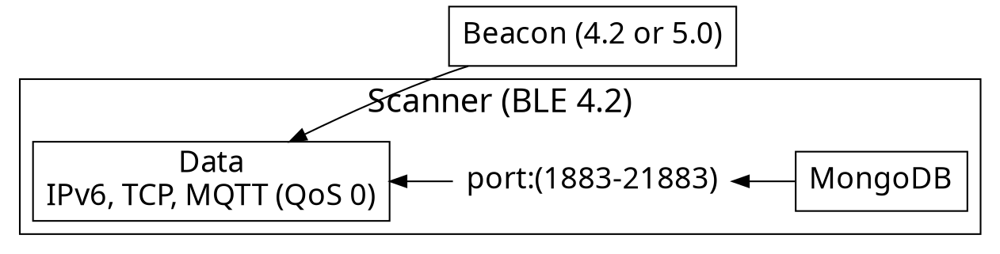

# TCP Socket in GNS3

<!-- Put the link to this slide here so people can follow -->
slide: https://hackmd.io/p/template-Talk-slide

---

GNS3 allows the use of Docker files that enable the virualization of different components (StoneWork, Open vSwitch or Ubuntu-Docker-Guest).

In order to test network connectivity and simulate data traffic, the source files will be executed in two Ubuntu-Docker-Guest nodes, in order to observe the data transmission between client-server (in this case, UE-server).
 

---

## Project Folders

- :file_folder: tcpsocket-gns3 
    - Main folder with source code files for server and client, (Python 2.7)

---


### Usage flow

---



---
## Software Requirements

- GNS3
- VirtualBox
- GNS3_VM
- Ubuntu-Docker-Guest
---


## Required libraries


### Python (2.7.18)

```typescript
import socket
```

<br>

---

### Wrap up

- Cross envornment commnication
- A small library to solve messaging pain


---

### Thank you! :heart: 

You can find me on

- GitHub
